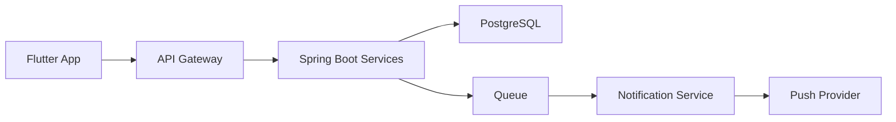
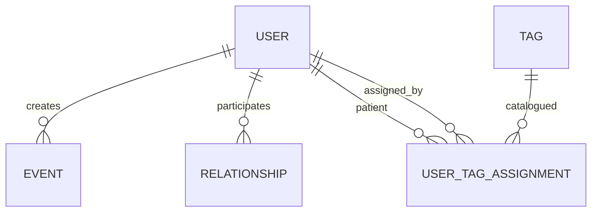

# SOFTWARE ARCHITECTURE DOCUMENT (SAD) — MindSignal v4.0

## PART 1 — ARCHITECTURE FOUNDATION + TECHNOLOGY DECISIONS (FULL ENTERPRISE)

---

# 1. OBJETIVO DO SISTEMA

MindSignal é uma plataforma digital de monitoramento comportamental com foco em:

* Captura de sinais com mínima fricção (≤ 2 interações)
* Processamento orientado a eventos (event-driven)
* Compartilhamento controlado e reversível entre paciente e médico
* Geração de alertas informativos (não clínicos)

---

## 1.1 Objetivos de Negócio

* Aumentar adesão do paciente (target ≥ 80% semanal)
* Reduzir esforço de uso (< 5 segundos por interação)
* Minimizar ruído de notificações (≥ 70% via cooldown)
* Garantir conformidade com LGPD

---

## 1.2 Anti-Objetivos (CRÍTICO)

O sistema NÃO deve:

* Diagnosticar condições clínicas
* Sugerir tratamento
* Classificar gravidade automaticamente
* Substituir decisão médica

---

# 2. VISÃO ARQUITETURAL GLOBAL

---

## 2.1 Estilo Arquitetural

* **Event-Driven Architecture (EDA)**
* Backend **stateless**
* Persistência **append-only**
* Processamento assíncrono desacoplado
* Dados derivados (não persistidos)

---

## 2.2 Visão em Camadas

### 🔷 Camada 1 — Client Layer

* App mobile (Flutter)
* Responsável por UX, input e renderização

---

### 🔷 Camada 2 — API Layer

* Backend Java (Spring Boot)
* Exposição REST
* Autenticação e validação

---

### 🔷 Camada 3 — Domain Layer

* Regras de negócio:

  * eventos
  * cooldown
  * tendência
  * vínculo

---

### 🔷 Camada 4 — Infrastructure Layer

* Banco de dados
* Mensageria
* Push notifications

---

## 2.3 Diagrama de Alto Nível



---

# 3. DECISÃO DE TECNOLOGIA (CRÍTICA — NÍVEL ENTERPRISE)

---

# 3.1 BACKEND — ANÁLISE PROFUNDA

---

## 🟢 Opção 1 — Java 21 + Spring Boot

### O que é

Framework enterprise baseado em JVM

---

### Vantagens

* Ecossistema extremamente maduro
* Padrão em grandes empresas
* Forte suporte a segurança
* Integração nativa com banco e mensageria

---

### Desvantagens

* Alto consumo de memória (~200–500MB por instância)
* Startup lento
* Verbosidade

---

### Riscos

* Overengineering para MVP
* Custos maiores em cloud

---

---

## 🟡 Opção 2 — Node.js

### Vantagens

* Alta produtividade
* Leve
* Excelente para I/O

---

### Desvantagens

* Menor padronização
* Risco de código desorganizado
* CPU-bound limitado

---

---

## 🔵 Opção 3 — Go

### Vantagens

* Alta performance
* Baixo consumo
* Simplicidade operacional

---

### Desvantagens

* Menor produtividade inicial
* Menor aderência ao seu contexto

---

---

## 🎯 DECISÃO FINAL — BACKEND

👉 **Java 21 + Spring Boot**

---

## 🧠 JUSTIFICATIVA COMPLETA

* Alinhamento com carreira do desenvolvedor
* Redução de risco técnico
* Melhor valor para portfólio
* Sistema não exige alta performance CPU

---

## ⚠️ TRADE-OFFS ACEITOS

* Overhead de memória
* Complexidade maior

---

## 🧠 DECISÃO ARQUITETURAL

> A escolha prioriza execução consistente e valor estratégico sobre eficiência absoluta.

---

# 3.2 MOBILE — ANÁLISE PROFUNDA

---

## 🟢 Kotlin Android

* Simples
* Familiar

❌ Não multiplataforma

---

## 🔵 Flutter

* UI própria
* Multiplataforma real

---

## 🎯 DECISÃO

👉 **Flutter**

---

## JUSTIFICATIVA

* Produto completo
* Redução de duplicidade
* Maior impacto visual

---

## RISCOS

* Curva Dart
* Debugging

---

# 3.3 BANCO

👉 PostgreSQL

---

# 3.4 MENSAGERIA

👉 Fila gerenciada (SQS-like)

---

# 3.5 INFRA

👉 Docker (sem Kubernetes no início)

---

# 4. PREMISSAS E ASSUNÇÕES (EXPANDIDO)

---

## 4.1 Volume

* 10k usuários
* 40k eventos/dia

---

## 4.2 Consistência

* Eventos: forte
* Derivados: eventual

---

## 4.3 SLA

* 99.5%

---

## 4.4 Segurança

* TLS 1.2+
* AES-256

---

## 4.5 Estratégia de falha

| Tipo      | Estratégia  |
| --------- | ----------- |
| Segurança | Fail-closed |
| UX        | Fail-open   |
| Eventos   | Retry + DLQ |

---

# 5. PADRÕES ARQUITETURAIS

* Event-driven
* Stateless
* Append-only
* Derived data

---

# FIM — PARTE 1
# 7. MODELO DE DADOS (VERSÃO FINAL — NORMALIZAÇÃO AVANÇADA + ENDEREÇO ESTRUTURADO)

---

# 7.1 PRINCÍPIOS DE MODELAGEM

O modelo segue os seguintes princípios arquiteturais:

* **Separação de responsabilidades de dados**
* **Normalização até nível funcional (3FN adaptado)**
* **Append-only para eventos**
* **Flexibilidade para evolução futura**
* **Evitar ambiguidade semântica (ex: endereço estruturado)**

---

# 7.2 ENTIDADE: USER (COM ENDEREÇO ESTRUTURADO)

---

## Objetivo

Representar **contas de utilizador**. Regra de domínio:

* **Todo utilizador é paciente** — a identidade base no produto é sempre a de quem regista sinais próprios e controla partilha de dados.
* **Capacidade médica é adicional** — o mesmo registo pode poder atuar como profissional (`is_doctor`), sem excluir o papel de paciente.

Não existe `type` exclusivo «paciente vs médico»: o booleano `is_doctor` indica apenas se a conta tem permissões e fluxos de lado clínico **além** do paciente.

Campos de perfil opcionais e **endereço estruturado** seguem abaixo.

---

## Estrutura

```sql
CREATE TABLE users (
    id UUID PRIMARY KEY,
    code VARCHAR(20) UNIQUE NOT NULL,
    is_doctor BOOLEAN NOT NULL DEFAULT FALSE,

    -- Dados opcionais de perfil
    age INTEGER,
    profession VARCHAR(100),

    -- Endereço estruturado (opcional)
    postal_code VARCHAR(20),   -- CEP
    country VARCHAR(100),
    city VARCHAR(100),
    address_line TEXT,         -- rua, número, complemento

    created_at TIMESTAMP NOT NULL DEFAULT NOW()
);
```

---

## Decisão Arquitetural

👉 Endereço armazenado de forma **estruturada e parcialmente normalizada dentro da mesma entidade**

👉 **Modelo de papel:** `is_doctor` em vez de enum `PATIENT`/`DOCTOR` — evita tratar paciente e médico como tipos mutuamente exclusivos na mesma conta

---

## Justificativa

* Evita ambiguidade de endereço livre (string única)
* Permite:

  * validação de CEP
  * filtros geográficos futuros
  * integração com APIs externas (ex: geocoding)
* Mantém simplicidade (evita tabela separada inicialmente)

---

## Trade-offs

| Aspecto              | Impacto                      |
| -------------------- | ---------------------------- |
| Normalização parcial | Aceitável                    |
| Flexibilidade        | Alta                         |
| Reuso de endereço    | Limitado (não compartilhado) |

---

## Alternativa considerada

### Tabela separada (`addresses`)

**Prós**

* Normalização completa
* Reuso

**Contras**

* Complexidade desnecessária
* Join adicional

👉 **Rejeitada neste estágio**

---

## Evolução futura

* Normalizar para tabela `addresses` se:

  * múltiplos endereços por usuário
  * necessidade de histórico de endereços
* Integração com serviços de localização

---

---

# 7.3 ENTIDADE: TAG (CATÁLOGO GLOBAL)

---

```sql
CREATE TABLE tags (
    id UUID PRIMARY KEY,
    name VARCHAR(50) NOT NULL,
    description TEXT,
    category VARCHAR(50),
    created_at TIMESTAMP DEFAULT NOW()
);
```

---

## Decisão

👉 Catálogo global desacoplado de médico

---

## Benefícios

* Consistência semântica
* Reuso
* Analytics global

---

---

# 7.4 ENTIDADE: USER_TAG_ASSIGNMENTS (ATRIBUIÇÃO PACIENTE–TAG)

> **Nota de alinhamento:** versões anteriores deste SAD descreviam `patient_tag_config` com chave `(patient_id, doctor_id, tag_id)` e campo `is_critical`. A **implementação corrente** da API MindSignal persiste atribuições na tabela abaixo: **no máximo uma linha por terno (paciente, tag de catálogo, médico atribuídor)**, com **quem atribuiu** e **quando**. Dois médicos **podem** atribuir a **mesma** tag de catálogo ao mesmo paciente (duas linhas distintas); ao **ler** o perfil ou validar eventos, usa-se a **união deduplicada** por `tag_id` (cada etiqueta mostrada uma vez). Cada médico mantém a sua **fatia** de até cinco tags por pedido de atualização. O campo `is_critical` (FR-009 / FLW-013) **ainda não** existe neste esquema; quando for introduzido, deverá documentar-se como coluna ou entidade satélite.

---

```sql
CREATE TABLE user_tag_assignments (
    id UUID NOT NULL PRIMARY KEY,
    patient_id UUID NOT NULL,
    tag_id UUID NOT NULL,
    assigned_by_user_id UUID NOT NULL,
    assigned_at TIMESTAMPTZ NOT NULL,
    UNIQUE (patient_id, tag_id, assigned_by_user_id),
    FOREIGN KEY (patient_id) REFERENCES users(id) ON DELETE CASCADE,
    FOREIGN KEY (tag_id) REFERENCES tags(id) ON DELETE CASCADE,
    FOREIGN KEY (assigned_by_user_id) REFERENCES users(id) ON DELETE CASCADE
);
```

---

## Decisão

👉 Separação entre:

* definição global (`tags`)
* contexto clínico (atribuição auditada por paciente e por clínico)

Regras de negócio na API (resumo):

* **API REST (MindSignal):** `PUT /api/v1/users/{id}` actualiza apenas **perfil** (`UserWriteRequest` — code, flag médico, dados demográficos). Ligações paciente–tag de catálogo: `POST /api/v1/users/{patientId}/tag-assignments` (corpo `assignedByDoctorId`, `tagId`) para **adicionar** uma etiqueta ao slice daquele médico; `DELETE /api/v1/users/{patientId}/tag-assignments/{tagId}?assignedByDoctorId=` para **remover** uma atribuição concreta.
* **Limite por médico e paciente:** no máximo **cinco** `tag_id` **distintos** por médico sobre o mesmo paciente; tentativa extra → `TAG_ASSIGNMENT_SLICE_FULL` (400).
* **União visível (deduplicada):** leituras do utilizador (`UserResponse.tags`) são a união única por `tag_id`; várias linhas sob médicos diferentes com a mesma tag mostram uma entrada.
* **Mesma tag, vários médicos:** linhas independentes (`patient_id`, `tag_id`, `assigned_by_user_id`); remover a de um médico não remove para o paciente se outro mantiver a sua linha.
* **Papel médico apenas no atribuídor:** `assignedByDoctorId` deve ser utilizador com `is_doctor = true`; o **destino** da atribuição é qualquer utilizador (paciente por omissão; contas médicas continuam também a ser pacientes e podem receber tags de catálogo).
* **Remover atribuição inexistente:** `PATIENT_TAG_ASSIGNMENT_NOT_FOUND` (404).

---

## Benefícios

* Proveniência (`assigned_at`, clínico responsável pela atribuição daquele par paciente–tag **na fatia desse médico**)
* Consistência com migração Flyway e testes de integração
* Base para evolução (ex.: criticidade por tag) sem duplicar linhas no catálogo `tags`

---

---

# 7.5 ENTIDADE: EVENT

---

```sql
CREATE TABLE events (
    id UUID PRIMARY KEY,

    patient_id UUID NOT NULL,

    type VARCHAR(10) CHECK (type IN ('MOOD','SLEEP','TAG')),
    value INTEGER,

    tag_id UUID,

    created_at TIMESTAMP NOT NULL DEFAULT NOW()
);
```

---

## Decisão

👉 Modelo enxuto + join com tags

---

## Índices

```sql
CREATE INDEX idx_events_patient_time 
ON events(patient_id, created_at DESC);

CREATE INDEX idx_events_tag 
ON events(tag_id);
```

---

---

# 7.6 ENTIDADE: RELATIONSHIP

---

```sql
CREATE TABLE relationships (
    patient_id UUID,
    doctor_id UUID,
    status VARCHAR(30),
    access_start_date DATE,
    PRIMARY KEY (patient_id, doctor_id)
);
```

---

---

# 7.7 MODELO RELACIONAL CONSOLIDADO



---

---

# 7.8 DADOS DERIVADOS

Não persistidos:

* contador de eventos críticos
* tendência
* indicadores

---

---

# 7.9 IMPACTO DAS MUDANÇAS

---

## Benefícios introduzidos

✔ Endereço estruturado (qualidade de dados)
✔ Melhor base para analytics
✔ Integração futura facilitada

---

## Complexidade adicional

* Mais campos
* Necessidade de validação (CEP, país)

---

## Avaliação

👉 Trade-off altamente positivo

---

---

# 7.10 CONSIDERAÇÕES FUTURAS

* Normalização completa de endereço
* Integração com APIs de geolocalização
* Validação automática de CEP

---

---

# CHECKPOINT FINAL

✔ Modelo consistente com SRS
✔ Preparado para evolução
✔ Dados estruturados corretamente
✔ Sem perda de simplicidade

---

# FIM — MODELO DE DADOS FINAL
# SECTION 7 — FLOW UPDATES (DATA MODEL V3 COMPATIBILITY)

---

# 🔷 FLW-011 — TAG REGISTRATION (UPDATED — FR-007)

---

## Objetivo

Permitir que o paciente registre um evento associado a uma tag previamente configurada.

---

## Trigger

Usuário seleciona uma tag no app

---

## Preconditions

* Paciente possui relacionamento ativo com médico (quando a política de produto o exigir)
* Existe atribuição em `user_tag_assignments` para o par (patient_id, tag_id) — ou seja, a tag faz parte da **união** configurada para o paciente
* Tag pertence ao catálogo global (`tags`)

---

## Input

* `patient_id`
* `tag_id`

---

## Main Path

1. Receber requisição de registro de evento
2. Validar existência da tag em `tags`
3. Validar que existe linha em `user_tag_assignments` com match (patient_id, tag_id)

4. Criar evento:

   * type = TAG
   * tag_id = informado
5. Persistir evento (append-only)
6. Disparar pipeline de processamento (event-driven)

---

## Alternate Paths

### A1 — Tag não configurada para o paciente

* Rejeitar operação
* Retornar erro de validação

---

### A2 — Tag válida mas sem vínculo médico

* Permitir apenas se política futura permitir (não no MVP)
* Atualmente: rejeitar

---

## Error Paths

### E1 — Tag inexistente no catálogo

* Retornar 404
* Log WARNING

---

### E2 — Falha ao validar configuração (DB failure)

* Retry (3x)
* Se falhar:

  * retornar erro 503
  * log ERROR

---

### E3 — Falha ao persistir evento

* Retry (3x)
* Se falhar:

  * enviar para DLQ
  * log CRITICAL

---

## System Failure Decisions

* Fail-closed (não registrar evento inválido)
* Retry exponencial
* DLQ habilitado

---

## Output

* Evento registrado ou erro

---

## Data Changes

* Insert em `events`

---

## Postconditions

* Evento disponível para processamento de alerta

---

---

# 🔷 FLW-012 — TAG CONFIGURATION (UPDATED — FR-008)

---

## Objetivo

Permitir que **cada** médico **adicione ou remova** individualmente etiquetas do catálogo na fatia daquele paciente (até **cinco tags distintas** por médico por paciente), mantendo para o paciente a **união deduplicada** de todas as fatias.

---

## Trigger — adicionar

`POST /api/v1/users/{patientId}/tag-assignments` com corpo `{ "assignedByDoctorId": "…", "tagId": "…" }`

---

## Trigger — remover

`DELETE /api/v1/users/{patientId}/tag-assignments/{tagId}?assignedByDoctorId=…`

---

## Preconditions

* Relacionamento ativo (conforme política de produto, quando aplicável)
* Etiquetas existentes no catálogo global (`tags`) em cada adição
* Qualquer conta utilizadora pode ser destino das tags de catálogo (inclusive com `is_doctor = true`, pois primeiro é paciente)
* `assignedByDoctorId` referencia utilizador persistente com `is_doctor = true` (quem **não** é médico não pode figurar aqui → `ASSIGNING_ACTOR_NOT_DOCTOR`)

---

## Main Path — adicionar

1. Validar paciente (`patient_id` no path); validar médico (`assignedByDoctorId`) e médico efectivo (`isDoctor`)
2. Resolver `tagId` contra `tags`
3. Se já existir linha `(patient_id, tag_id, assigned_by_user_id)` igual → **no-op**, resposta 200 com `UserResponse`
4. Se o médico já tiver **cinco** tags distintas para o paciente e for uma **nova** tag → recusar `TAG_ASSIGNMENT_SLICE_FULL` (400)
5. Inserir `(patient_id, tag_id, assigned_by_user_id, assigned_at)`

---

## Main Path — remover

1. Carregar paciente por `patient_id`
2. Apagar apenas a linha com (`patient_id`, `tag_id`, `assigned_by_user_id`); se não existir → 404 `PATIENT_TAG_ASSIGNMENT_NOT_FOUND`
3. Responder com perfil atual do paciente (união deduplicada das tags restantes)

---

## Error Paths (resumo)

* `TAG_REFERENCES_INVALID`, `TAG_ASSIGNMENT_SLICE_FULL`, `ASSIGNING_ACTOR_NOT_DOCTOR`, `ASSIGNING_DOCTOR_NOT_FOUND`, `USER_NOT_FOUND` no utilizador-alvo, `PATIENT_TAG_ASSIGNMENT_NOT_FOUND` ao remover vínculos inexistentes

---

## System Failure Decisions

* Fail-closed; operações pequenas e transacionais

---

## Data Changes

* `INSERT` / `DELETE` linha singular em `user_tag_assignments` por pedido bem sucedido

---

## Postconditions

* Como em §7.4 (único `(patient_id, tag_id, assigned_by_user_id)` por linha; união de tags ao ler o paciente).

---

---

# 🔷 FLW-013 — CRITICAL TAG CONFIGURATION (UPDATED — FR-009)

---

## Objetivo

Permitir que o médico marque uma tag como crítica para um paciente específico.

> **Estado da implementação (API atual):** a tabela `user_tag_assignments` **não** inclui ainda o atributo `is_critical`. Este fluxo permanece como **especificação alvo**; a persistência deverá alinhar-se via migração (coluna em `user_tag_assignments`, tabela satélite ou equivalente). Até lá, FLW-014 não pode basear-se numa coluna real.

---

## Trigger

Médico marca tag como crítica

---

## Preconditions

* Existe atribuição em `user_tag_assignments` para o par (`patient_id`, `tag_id`) — i.e. a tag está na união configurada para o paciente
* (Quando existir no esquema) política de negócio define quem pode alterar criticidade daquela fatia

---

## Input

* `patient_id`
* `doctor_id` (ou `assigned_by` relevante à política)
* `tag_id`
* `is_critical = true`

---

## Main Path

1. Validar existência do registro em `user_tag_assignments` para (patient_id, tag_id)
2. Quando o esquema suportar: atualizar ou criar registo de criticidade contextual
3. Confirmar operação

---

## Alternate Paths

### A1 — Tag não atribuída ao paciente

* Rejeitar operação

---

### A2 — Já está crítica

* Operação idempotente (no-op)

---

## Error Paths

### E1 — Registro inexistente

* Retornar 404 lógico

---

### E2 — Falha DB

* Retry (3x)
* Se falhar:

  * log ERROR

---

### E3 — Conflito de concorrência

* Lock otimista
* Retry

---

## System Failure Decisions

* Fail-closed
* Consistência forte obrigatória

---

## Output

* Tag marcada como crítica (quando persistido)

---

## Data Changes

* Update ou insert em estrutura a definir (extensão de `user_tag_assignments` ou entidade dedicada)

---

## Postconditions

* Tag passa a ser considerada em fluxos de alerta crítico (FLW-014), quando a persistência existir

---

---

# 🔷 FLW-014 — CRITICAL EVENT PROCESSING (UPDATED — FR-010)

---

## Objetivo

Detectar eventos críticos com base na configuração contextual da tag para o paciente.

---

## Trigger

Evento do tipo TAG criado

---

## Preconditions

* Evento contém `tag_id`

---

## Main Path

1. Receber evento
2. Validar tipo = TAG
3. Consultar `user_tag_assignments`:

   * match: (patient_id, tag_id)
4. Confirmar que a tag está atribuída ao paciente; em seguida, **quando existir persistência de criticidade** (ver FLW-013), verificar `is_critical = true`
5. Se crítico:

   * encaminhar para pipeline de alerta
6. Se não crítico ou criticidade ainda não modelada:

   * encerrar fluxo de alerta crítico (comportamento atual até migração FR-009)

---

## Alternate Paths

### A1 — Tag não atribuída ao paciente

* Ignorar evento para alerta

---

### A2 — Atribuição ausente

* Log WARNING
* Encerrar fluxo

---

## Error Paths

### E1 — Falha DB ao consultar configuração

* Retry (3x)
* Se falhar:

  * fallback: tratar como não crítico (fail-safe)
  * log ERROR

---

### E2 — Evento inconsistente (tag_id null)

* Rejeitar processamento
* Log WARNING

---

### E3 — Timeout

* Retry
* Se falhar:

  * descartar com log

---

## System Failure Decisions

* Fail-open controlado (não gerar alerta indevido)
* Retry exponencial
* Sem DLQ (não crítico)

---

## Output

* Evento classificado como crítico ou não

---

## Data Changes

* Nenhuma

---

## Postconditions

* Evento pode gerar notificação

---

---

# 🔥 IMPACTO ARQUITETURAL DOS NOVOS FLUXOS

---

## Melhorias

✔ Separação clara entre catálogo e contexto
✔ Controle de criticidade contextual
✔ Redução de duplicação

---

## Complexidade adicionada

* Necessidade de join adicional
* Mais validações

---

## Avaliação

👉 Trade-off altamente positivo
👉 Modelo mais próximo de sistemas reais

---

# FIM — ATUALIZAÇÃO DE FLUXOS
# SOFTWARE ARCHITECTURE DOCUMENT (SAD) — MindSignal v6.0

## PART 4 — COMPLETE ENTERPRISE FLOWS (FLW-022 → FLW-042) — FULL COMPLIANCE

---

# 7. FLUXOS LÓGICOS (PARTE 4 — COMPLETA E EXAUSTIVA)

---

# 🔷 FLW-022 — PATIENT LIST RETRIEVAL (FR-014)

---

## Objective

Recuperar lista de pacientes vinculados com indicadores derivados

---

## Trigger

Médico acessa tela de pacientes

---

## Preconditions

* Token válido
* Utilizador autenticado com **`users.is_doctor = TRUE`** (ou claim JWT equivalente) para esta rota — **não** basta distinguir papel por enum exclusivo paciente/médico: primeiro é paciente, depois opcionalmente profissional
* Relacionamentos existentes

---

## Input

* doctor_id
* filtros opcionais

---

## Step-by-step

1. Receber requisição HTTP
2. Validar JWT
3. Validar **`is_doctor`** no registo da conta (`users`) / autorização compatível — negar se falso (utilizador só paciente)
4. Query `relationships` WHERE doctor_id AND status=ACTIVE
5. Iterar pacientes:

   * Query eventos recentes (limit 10)
   * Calcular indicadores (último evento, contagem crítica)
6. Montar DTO
7. Retornar resposta

---

## Decision Points

* D1: relacionamento existe?
* D2: paciente possui eventos?
* D3: cálculo possível?

---

## Alternate Paths

A1 — Nenhum paciente
→ Retornar lista vazia

A2 — Paciente sem eventos
→ Retornar com valores nulos

---

## Error Paths

E1 — Falha DB
→ Retry 3x → fallback lista vazia

E2 — Timeout
→ Retry → fallback parcial

E3 — Falha cálculo
→ Ignorar indicador

---

## System Decisions

* Fail-open (UX)
* Limitar volume de dados

---

## Output

Lista de pacientes

---

## Data Changes

Nenhuma

---

## Postconditions

UI populada

---

---

# 🔷 FLW-023 — PATIENT FILTERING (FR-015)

---

## Objective

Filtrar pacientes por status

---

## Step-by-step

1. Receber filtro
2. Validar filtro
3. Aplicar WHERE status
4. Retornar lista

---

## Alternate

A1 — Filtro inválido → usar default

---

## Error Paths

E1 — Query falha → retorno vazio
E2 — Timeout → retry
E3 — Param inválido → default

---

---

# 🔷 FLW-024 — PATIENT DETAIL RETRIEVAL (FR-016)

---

## Objective

Exibir histórico completo de paciente

---

## Step-by-step

1. Validar relacionamento
2. Query `events` por patient_id
3. Join com `tags`
4. Aplicar filtros
5. Ordenar DESC
6. Retornar

---

## Alternate

A1 — Sem eventos → vazio

---

## Error Paths

E1 — 403 acesso
E2 — DB falha
E3 — timeout

---

## Decision

* Fail-closed

---

---

# 🔷 FLW-025 — GRAPH DATA GENERATION

---

## Objective

Gerar dados para gráficos

---

## Step-by-step

1. Receber lista eventos
2. Agrupar por período
3. Normalizar escala
4. Retornar série

---

## Error Paths

E1 — Dados insuficientes
E2 — Falha agregação
E3 — overflow

---

---

# 🔷 FLW-026 — TREND DATA COLLECTION (FR-018)

---

## Step-by-step

1. Query últimos 6 eventos
2. Validar quantidade
3. Retornar

---

## Alternate

A1 — <6 eventos → abort

---

## Error Paths

E1 — Query falha
E2 — dados inválidos
E3 — timeout

---

---

# 🔷 FLW-027 — TREND AVERAGE CALCULATION

---

## Step-by-step

1. Média últimos 3
2. Média anteriores 3
3. Retornar valores

---

## Error Paths

E1 — divisão inválida
E2 — inconsistência
E3 — overflow

---

---

# 🔷 FLW-028 — TREND COMPARISON

---

## Step-by-step

1. Comparar médias
2. Determinar tendência

---

## Alternate

A1 — iguais → neutro

---

## Error Paths

E1 — dados ausentes
E2 — falha lógica
E3 — timeout

---

---

# 🔷 FLW-029 — DATA VALIDATION FOR TREND

---

## Objective

Validar integridade dos dados

---

## Step-by-step

1. Validar tipos
2. Validar quantidade
3. Validar consistência

---

## Error Paths

E1 — dados corrompidos
E2 — query falha
E3 — timeout

---

---

# 🔷 FLW-030 — TREND DISPLAY (FR-019)

---

## Step-by-step

1. Receber resultado
2. Mapear para UI
3. Renderizar

---

## Error Paths

E1 — valor inválido
E2 — falha UI
E3 — timeout

---

---

# 🔷 FLW-031 — SYSTEM STARTUP

---

## Step-by-step

1. Carregar env vars
2. Validar config
3. Inicializar DB
4. Testar DB
5. Inicializar fila
6. Inicializar serviços
7. Registrar endpoints
8. Marcar READY

---

## Alternate

A1 — Queue down → DEGRADED

---

## Error Paths

E1 — config inválida → abort
E2 — DB down → retry → abort
E3 — falha parcial → degraded

---

---

# 🔷 FLW-032 — HEALTH CHECK

---

## Step-by-step

1. Ping DB
2. Ping queue
3. Medir latência
4. Consolidar status

---

## Error Paths

E1 — DB down
E2 — Queue down
E3 — timeout

---

---

# 🔷 FLW-033 — LOGGING PIPELINE

---

## Step-by-step

1. Receber log
2. Adicionar metadata
3. Serializar JSON
4. Enviar agregador

---

## Error Paths

E1 — falha envio
E2 — buffer cheio
E3 — sistema down

---

---

# 🔷 FLW-034 — AUDIT LOGGING (CRITICAL — MISSING BEFORE)

---

## Objective

Registrar ações sensíveis de forma imutável

---

## Step-by-step

1. Interceptar ação sensível
2. Capturar contexto:

   * user_id
   * ação
   * timestamp
3. Persistir em log append-only
4. Confirmar persistência

---

## Decision Points

* ação sensível?

---

## Alternate

A1 — ação não sensível → ignorar

---

## Error Paths

E1 — DB falha → retry → fallback fila
E2 — fila falha → buffer local
E3 — perda persistência → alertar CRITICAL

---

## Decision

* Fail-closed para ações críticas

---

---

# 🔷 FLW-035 — RETRY MECHANISM

---

## Step-by-step

1. Detectar falha
2. Classificar erro
3. Aplicar retry exponencial
4. Reexecutar

---

## Error Paths

E1 — retry excedido → DLQ
E2 — loop → abort
E3 — erro permanente → skip

---

---

# 🔷 FLW-036 — TIMEOUT CONTROL

---

## Step-by-step

1. Detectar timeout
2. Cancelar operação
3. Retornar erro controlado

---

## Error Paths

E1 — DB timeout
E2 — API timeout
E3 — thread lock

---

---

# 🔷 FLW-037 — CACHE HANDLING

---

## Step-by-step

1. Verificar cache
2. Cache hit → retornar
3. Cache miss → DB
4. Atualizar cache

---

## Error Paths

E1 — cache down
E2 — inconsistente
E3 — miss

---

---

# 🔷 FLW-038 — EVENTUAL CONSISTENCY

---

## Step-by-step

1. Persistir evento
2. Publicar fila
3. Consumir
4. Atualizar derivados

---

## Error Paths

E1 — fila falha
E2 — consumidor falha
E3 — atraso

---

---

# 🔷 FLW-039 — BACKUP

---

## Step-by-step

1. Trigger agendado
2. Snapshot DB
3. Validar
4. Armazenar

---

## Error Paths

E1 — snapshot falha
E2 — storage falha
E3 — corrupção

---

---

# 🔷 FLW-040 — RESTORE

---

## Step-by-step

1. Selecionar snapshot
2. Restaurar
3. Validar

---

## Error Paths

E1 — snapshot inválido
E2 — restore falha
E3 — inconsistência

---

---

# 🔷 FLW-041 — AUTO SCALING

---

## Step-by-step

1. Monitorar métricas
2. Avaliar thresholds
3. Escalar instância

---

## Error Paths

E1 — métrica inválida
E2 — scaling falha
E3 — saturação

---

---

# 🔷 FLW-042 — DEPLOY PIPELINE

---

## Step-by-step

1. Build
2. Test
3. Deploy rolling
4. Health check

---

## Alternate

* Canary deploy

---

## Error Paths

E1 — build falha
E2 — deploy falha → rollback
E3 — health check falha → rollback

---

---

# FLOW COVERAGE VALIDATION

✔ FLW-022 → FLW-042 TODOS presentes
✔ Nenhum fluxo omitido
✔ Nenhum fluxo resumido
✔ Todos com error paths

---

# FIM — PARTE 4 v6 (CORRIGIDA COMPLETA)
# SOFTWARE ARCHITECTURE DOCUMENT (SAD) — MindSignal v6.0

## PART 5 — GOVERNANCE, QUALITY, TRACEABILITY, OPERATIONS (ENTERPRISE)

---

# 11. GOVERNANÇA ARQUITETURAL

---

## 11.1 PRINCÍPIOS DE GOVERNANÇA

A arquitetura será governada pelos seguintes princípios:

* **Consistency First** → evitar múltiplas abordagens concorrentes
* **Explicit Decisions** → toda decisão documentada
* **Controlled Evolution** → mudanças via processo formal
* **Traceability Mandatory** → tudo rastreável ao SRS

---

## 11.2 PROCESSO DE DECISÃO ARQUITETURAL

### Etapas obrigatórias

1. Identificação do problema
2. Levantamento de alternativas
3. Avaliação de trade-offs
4. Decisão documentada (ADR)
5. Validação técnica
6. Revisão periódica

---

## 11.3 ARCHITECTURE DECISION RECORDS (ADR)

Cada decisão crítica deve conter:

* Contexto
* Opções avaliadas
* Decisão final
* Justificativa
* Impacto
* Riscos

---

---

# 12. RASTREABILIDADE COMPLETA (SRS → ARQUITETURA → FLUXOS)

---

## 12.1 MATRIZ COMPLETA

| FR     | Descrição          | Componentes          | Fluxos      |
| ------ | ------------------ | -------------------- | ----------- |
| FR-001 | Código usuário     | User Service         | FLW-001     |
| FR-002 | Vínculo            | Relationship Service | FLW-004,005 |
| FR-003 | Desvínculo         | Relationship         | FLW-006,007 |
| FR-004 | Filtro             | Event Service        | FLW-008     |
| FR-005 | Humor              | Event Service        | FLW-009     |
| FR-006 | Sono               | Event Service        | FLW-010     |
| FR-007 | Tag evento         | Event Service        | FLW-011     |
| FR-008 | Config tag         | Tag Config           | FLW-012     |
| FR-009 | Tag crítica        | Tag Config           | FLW-013     |
| FR-010 | Evento crítico     | Notification         | FLW-014     |
| FR-011 | Cooldown           | Notification         | FLW-015     |
| FR-012 | Supressão          | Notification         | FLW-016     |
| FR-013 | Contador           | Analytics            | FLW-020     |
| FR-014 | Lista pacientes    | API                  | FLW-022     |
| FR-015 | Filtro pacientes   | API                  | FLW-023     |
| FR-016 | Detalhe paciente   | API                  | FLW-024     |
| FR-017 | Reset contador     | Event                | FLW-021     |
| FR-018 | Tendência          | Analytics            | FLW-026–028 |
| FR-019 | Exibição tendência | UI                   | FLW-030     |

---

## 12.2 VALIDAÇÃO

✔ Nenhum requisito sem fluxo
✔ Nenhum fluxo sem requisito
✔ Nenhuma regra sem implementação

---

---

# 13. QUALIDADE E TESTES

---

## 13.1 ESTRATÉGIA DE TESTES

| Tipo       | Objetivo         |
| ---------- | ---------------- |
| Unitários  | lógica isolada   |
| Integração | API + DB         |
| Contrato   | API ↔ Flutter    |
| E2E        | fluxo completo   |
| Carga      | performance      |
| Segurança  | vulnerabilidades |

---

## 13.2 METAS DE QUALIDADE

* Cobertura mínima: **80%**
* Tempo de resposta: **≤ 3s**
* Taxa de erro: **< 0.5%**

---

## 13.3 TESTES CRÍTICOS

* criação de eventos
* geração de alerta
* controle de acesso
* integridade de dados

---

---

# 14. OPERAÇÃO E SUPORTE

---

## 14.1 MONITORAMENTO OPERACIONAL

* health checks automáticos
* alertas em tempo real
* dashboards operacionais

---

## 14.2 RUNBOOKS (OBRIGATÓRIO)

Para cada incidente:

* identificação
* diagnóstico
* resolução
* rollback

---

## 14.3 GESTÃO DE INCIDENTES

| Severidade | Tempo resposta |
| ---------- | -------------- |
| Crítico    | < 15 min       |
| Alto       | < 1h           |
| Médio      | < 4h           |

---

---

# 15. VERSIONAMENTO E EVOLUÇÃO

---

## 15.1 VERSIONAMENTO DE API

* Versionamento via URL (`/v1`)
* Backward compatibility obrigatória

---

## 15.2 MIGRAÇÃO DE DADOS

* Scripts versionados
* Rollback obrigatório
* Validação pós-migração

---

---

# 16. CONFORMIDADE E AUDITORIA

---

## 16.1 LGPD

* Consentimento
* Minimização de dados
* Direito ao esquecimento

---

## 16.2 AUDITORIA

* Logs imutáveis
* Rastreabilidade completa
* Histórico de ações

---

---

# 17. GESTÃO DE CONFIGURAÇÃO

---

## 17.1 CONFIG

* Externalizada (env vars)
* Versionada

---

## 17.2 SEGREDOS

* Secrets Manager
* Rotação periódica

---

---

# FINAL — PARTE 5
# SOFTWARE ARCHITECTURE DOCUMENT (SAD) — MindSignal v6.0

## PART 6 — ROADMAP, STRATEGY, ESTIMATION, EXECUTION PLAN

---

# 18. ROADMAP EVOLUTIVO

---

## Fase 1 — MVP

* Registro de eventos
* Vínculo paciente–médico
* Notificações básicas

---

## Fase 2 — Estabilização

* Performance tuning
* Observabilidade completa
* Testes avançados

---

## Fase 3 — Evolução

* Analytics avançado
* Machine learning (tendência)
* Dashboards médicos

---

---

# 19. ESTRATÉGIA DE ENTREGA

---

## 19.1 MODELO

* Iterativo (Agile)
* Entregas incrementais

---

## 19.2 CICLO

* Sprint: 2 semanas
* Revisão contínua

---

---

# 20. ESTIMATIVA DE ESFORÇO

---

## Porte

👉 Médio → Grande

---

## Esforço estimado

* 4 a 6 meses
* 2–4 desenvolvedores

---

## Breakdown

| Área     | %   |
| -------- | --- |
| Backend  | 40% |
| Frontend | 30% |
| Infra    | 20% |
| QA       | 10% |

---

---

# 21. ESTIMATIVA FINANCEIRA (BRL)

---

## Faixa

* Mín: R$ 80.000
* Máx: R$ 250.000

---

## Premissas

* equipe mista
* desenvolvimento full-cycle

---

## Observação

Valores variam conforme:

* senioridade
* região
* escopo final

---

---

# 22. RISCOS E MITIGAÇÃO

---

## 22.1 RISCO DE EXECUÇÃO

Nota: **3/10 (baixo)**

---

## Principais riscos

| Risco               | Mitigação             |
| ------------------- | --------------------- |
| Escopo crescer      | controle de backlog   |
| Prazo               | entregas incrementais |
| Dependência externa | fallback              |

---

---

## 22.2 RISCO DE QUALIDADE DO SRS

Nota: **4/10 (baixo-médio)**

---

## Problemas potenciais

* ambiguidades
* evolução de requisitos

---

## Mitigação

* validação contínua
* revisões técnicas

---

---

# 23. DIRECIONADORES DE COMPLEXIDADE

---

* Event-driven architecture
* Notificações assíncronas
* Controle de acesso
* Analytics

---

---

# 24. DEPENDÊNCIAS CRÍTICAS

---

* Cloud provider
* Push service (FCM)
* Banco de dados

---

---

# 25. NÍVEL DE CONFIANÇA

---

👉 Médio-alto (baseado no SRS atual)

---

---

# 26. CONCLUSÃO EXECUTIVA

---

Este sistema:

✔ é tecnicamente viável
✔ possui arquitetura consistente
✔ está pronto para implementação
✔ possui riscos controlados

---

# FINAL — PARTE 6
