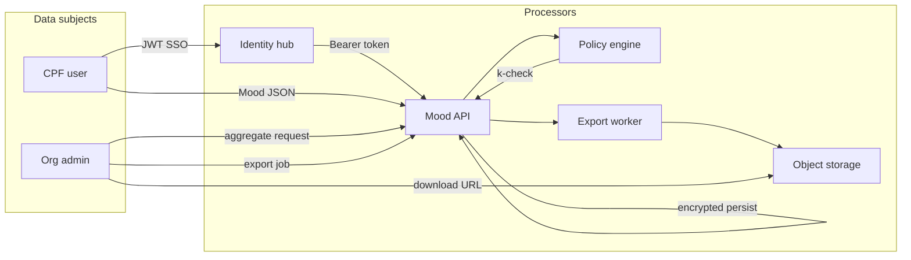

# LGPD Compliance Package — Hub de Controle de Humor

**Version:** v1  
**Date:** 2026-04-12  
**SRS baseline:** `docs/srs/SRS_v1.md`  
**SAD baseline:** `docs/sad/SAD_v1.md`  
**API baseline:** `docs/api/openapi_v1.yaml` (OpenAPI `info.version` 1.1.0)

---

## 1. Data classification

| Class | Examples | Controls |
| ----- | -------- | -------- |
| Sensível (saúde / humor) | Mood values, notes, clinical links | Legal basis Art. 11; minimization; access logging |
| Identificação | `user_id` UUID, display name | Pseudonymization; hub is identity provider |
| Agregado anonimizado | Export/analytics outputs | k=5 gate; review before download URL issuance |

---

## 2. Legal basis mapping (per feature)

| Feature (SRS) | Basis | Justification |
| ------------- | ----- | --------------- |
| Mood logging (FR-04) | Consent + contract (B2B workplace) where applicable | Self-monitoring / occupational health program with policy |
| Group analytics (FR-10) | Legitimate interest + safeguards OR consent | DPIA required for workplace monitoring; default consent path for community groups |
| Admin member-level reads | Consent / legal obligation / contract | Audited; visibility flags for INDIVIDUAL |
| Exports | Same as analytics + compatibility | Anonymization technical measure |
| Clinical link (FR-16) | Consent (Art. 8) | `consent_artifact_ids` mandatory |
| Audit (FR-17) | Legal obligation / security | Retention per matrix |

---

## 3. Data subject rights

| Right | Mechanism (MVP) | SLA |
| ----- | --------------- | --- |
| Access | `/v1/users/me` + export of own data (ticket if beyond API) | 15 business days package |
| Rectification | Profile PUT; mood note edit out of scope MVP — delete+recreate | Immediate where automated |
| Erasure | Account hub deletion triggers disable + retention purge job | 30 days after hub signal |
| Portability | JSON export of self mood history | Same as access |
| Objection | Revoke clinical link; leave group; toggle visibility | Per SRS FR-18/FR-19 |

---

## 4. Retention matrix

| Data | Active retention | Post-delete / revoke |
| ---- | ---------------- | -------------------- |
| Mood entries | Life of account + legal hold | Hard delete per FR-06; backups roll per NFR-05 |
| Audit | 5 years | immutable |
| Export artifacts | 7 days URL | object lifecycle delete |
| Clinical consent refs | Life of link + 5 years audit overlap | revoke stops processing |

---

## 5. Consent model

- Capture references only (`consent_artifact_ids`).  
- Withdrawal: clinical revoke (FR-19); group participation exit; hub-level account deletion.

---

## 6. Audit requirements

- Immutable append log for admin reads (FR-17).  
- Quarterly access review sample for org tenants.

---

## 7. Privacy controls

- k-anonymity default 5 (non-downgradable MVP).  
- RBAC from JWT roles + server-side Policy Engine (SAD).  
- Rate limits on aggregate/export (abuse re-identification attempts).

---

## 8. Data flow (end-to-end)

Hub authenticates → API stores mood in BR region → aggregates evaluated in Policy Engine → export worker writes anonymized object → time-limited URL → download logged.

### 8.1 Data flow diagram (logical)

---

## 9. Data Processing Agreements (DPA)

- Each CNPJ tenant **SHALL** execute a DPA with the platform operator before processing employee mood data in `INDIVIDUAL_PUBLIC` or workplace contexts.
- DPA exhibits: subprocessors list (§10), security measures (§11), subprocessor change notice (30 days), audit cooperation clause, international transfer safeguards (MVP: BR region only).

---

## 10. Subprocessor strategy

| Subprocessor class | Purpose | Control |
| --- | --- | --- |
| Cloud IaaS/PaaS | Compute, DB, object store | DPA + SCCs where applicable; BR region default |
| Hub identity | AuthN, consent artifacts storage | Separate agreement; data minimization in tokens |
| Observability vendor (optional) | Logs/metrics | No mood note content in logs; DPA + log scrubbing |

Changes to material subprocessors: **30-day** customer notification + updated register in trust portal (process).

---

## 11. Encryption and key management

- **In transit:** TLS 1.2+ everywhere; HSTS on public API; mTLS optional internal east-west (Should).
- **At rest:** DB TDE; object storage SSE-KMS; backup encryption mandatory.
- **Keys:** Cloud KMS CMK per environment; yearly rotation; emergency revoke runbook; webhook signing secrets per tenant (see OpenAPI export callback).

---

## 12. Privacy by design checklist (MVP gate)

| Control | Evidence |
| --- | --- |
| Data minimization | Notes optional; clinical stores consent refs only |
| Purpose limitation | Feature → legal basis matrix §2 |
| Default high privacy | k=5 non-downgradable; hidden default where SRS requires |
| Transparency | SRS + compliance package published to tenant admins |
| User control | Visibility flags, revoke clinical, leave group, delete mood |
| Security | RBAC + audit + rate limits |

---

## 13. Incident response

- Detect: SIEM alerts on export spikes + auth anomalies.  
- Contain: disable keys, pause worker.  
- Notify ANPD/data subjects per severity matrix within **72h** assessment start for serious incidents.

---

## 14. Risk register

| Risk | Severity | Mitigation |
| ---- | -------- | ---------- |
| k gate misconfiguration | High | Integration tests + feature flag kill switch |
| JWKS spoof/outage | Medium | TLS pin + cached keys + 503 fail closed |
| Hub subject rotation merge | Medium | Program open SRS item; manual reconcile playbook |

---

## 15. DPIA / workplace monitoring gate

Workplace deployments SHALL complete DPIA before enabling `INDIVIDUAL_PUBLIC` org-wide analytics; API may expose `GET /v1/compliance/dpia-status` (optional future) — **MVP:** process control via tenant onboarding checklist (non-API).
