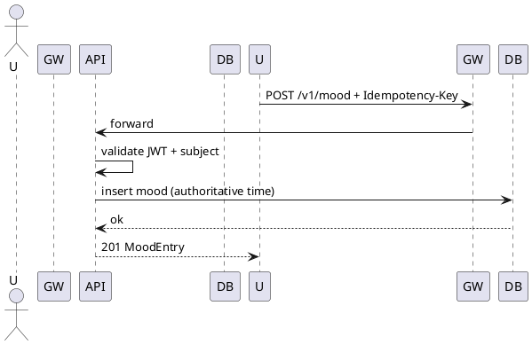
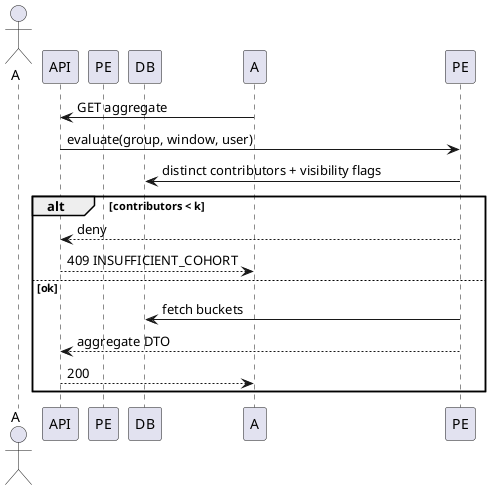
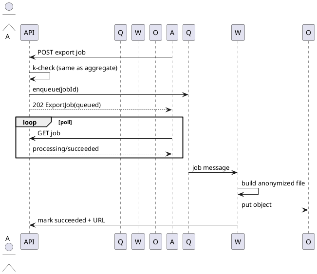
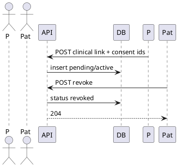

# Software Architecture Document (SAD)

**Product:** Hub de Controle de Humor  
**Version:** v1  
**SRS baseline:** `docs/srs/SRS_v1.md`  
**Date:** 2026-04-12  

---

## 1. Architecture style

**Style:** Modular monolith behind API gateway (MVP) with **async worker** for exports; path to service extraction documented.

**Justification:** Small team, strong consistency needs on mood writes, simpler LGPD boundary while proving product-market fit.

**Alternatives considered**

| Option | Pros | Cons | Verdict |
| --- | --- | --- | --- |
| Microservices day one | Independent scale | Ops burden, distributed tracing cost | Rejected for MVP |
| Serverless only | Pay per use | Cold start, long export jobs awkward | Rejected for MVP |
| Modular monolith + queue | Clear boundaries, fewer moving parts | Requires discipline to avoid coupling | **Selected** |

---

## 2. C4 — Context

```plantuml
@startuml
!include https://raw.githubusercontent.com/plantuml-stdlib/C4-PlantUML/master/C4_Context.puml
Person(user, "CPF/CNPJ user", "Web client")
Person(clin, "Clinician", "Web client")
System_Boundary(hub, "Identity hub") {
  System(hub_sso, "SSO + JWT", "JWKS")
}
System_Boundary(platform, "Mood platform") {
  System(api, "Mood API", "REST, JWT, policy")
  System(worker, "Export worker", "Anonymization jobs")
}
System_Ext(storage, "Object storage", "Presigned URLs")
Rel(user, hub_sso, "Auth")
Rel(clin, hub_sso, "Auth")
Rel(user, api, "HTTPS")
Rel(clin, api, "HTTPS")
Rel(api, hub_sso, "Validate JWT/JWKS")
Rel(api, worker, "Enqueue jobs")
Rel(worker, storage, "Write artifacts")
@enduml
```

---

## 3. C4 — Containers

```plantuml
@startuml
!include https://raw.githubusercontent.com/plantuml-stdlib/C4-PlantUML/master/C4_Container.puml
Person(client, "Client", "Browser / app")
System_Boundary(sys, "Mood platform") {
  Container(gw, "API Gateway", "TLS, rate limits, WAF")
  Container(app, "Application", "Modular monolith")
  ContainerDb(db, "Primary DB", "PostgreSQL")
  Container(queue, "Job queue", "SQS / Rabbit")
  Container(worker, "Worker", "Export + anonymization")
  ContainerDb(obj, "Object store", "S3-compatible")
  Container(cache, "Redis", "JWKS cache, idempotency")
}
Rel(client, gw, "HTTPS")
Rel(gw, app, "HTTP")
Rel(app, db, "SQL")
Rel(app, queue, "Publish")
Rel(worker, queue, "Consume")
Rel(worker, db, "Read cohort")
Rel(worker, obj, "PUT objects")
Rel(app, cache, "TCP")
Rel(worker, cache, "Optional locks")
@enduml
```

---

## 4. C4 — Components (application container)

| Component | Responsibility | Interfaces | Dependencies | Failure modes |
| --- | --- | --- | --- | --- |
| Auth middleware | JWT verify, tenant extract | Incoming HTTP | JWKS client | Hub outage → 503 fail closed |
| Mood service | CRUD mood | Internal module API | DB | DB timeout → 503 + retry safe |
| Group service | Groups, invites, membership | Internal | DB | Duplicate invite race → unique constraint |
| Policy engine | k-gate, visibility rules | Callable from API + worker | DB read models | Misconfig k → deny by default |
| Analytics projector | Precompute cohort sizes (optional) | Events / cron | DB | Stale counts → still safe if re-verify at request |
| Audit logger | Append-only admin reads | Async sink | DB / log bus | If sink down → fail request for sensitive reads |
| Export orchestrator | Create job, enqueue | REST + worker | Queue, worker | Queue backlog → user-visible delay only |

---

## 5. Logical data model

**Entities:** Tenant, User (subject id), Group, Membership, MoodEntry, Action, ExportJob, ClinicalLink, AuditEvent.

**Invariants**

- MoodEntry.user_id always equals authenticated subject for writes.
- Membership (user, group) unique.
- ExportJob stores frozen cohort policy hash at creation time.
- ClinicalLink.consent_artifact_ids length ≥ 1.

**Aggregates (DDD)**

- **Mood aggregate:** MoodEntry root per user; consistency boundary on write path.
- **Group aggregate:** Group + Membership + Invite as transactional boundary for admin operations.

---

## 6. Sequence diagrams (PlantUML)

### 6.1 Mood logging



### 6.2 Aggregation flow (k-gate)



### 6.3 Export job lifecycle



### 6.4 Clinical relationship



---

## 7. Data flow (request → aggregation → export)

1. **Request lifecycle:** Gateway terminates TLS, attaches `trace_id`, forwards to app. Auth middleware resolves `tenant_id`, `user_id`, `roles[]`.
2. **Aggregation logic:** Policy engine queries membership + mood rows in window, applies visibility masks from SRS BR tables, counts distinct eligible contributors, compares to k.
3. **Export processing:** Orchestrator reuses policy evaluation snapshot; worker reads same logical cohort, writes anonymized artifact, never logs row-level payload in clear text.

---

## 8. Deployment

- **Region:** Brazil primary (LGPD alignment with compliance package).
- **Tiers:** Public subnet (gateway only), private subnet (app, worker), data subnet (DB, Redis), VPC endpoints to object storage.
- **Scaling:** HPA on API from CPU + RPS; worker scaled on queue depth; DB vertical first, read replica **Should** for reporting.
- **Security zones:** Internet → WAF → Gateway → App (trust zone B) → DB (zone A). Secrets in managed vault; no long-lived cloud keys in app env.

---

## 9. Consistency and transactions

- Mood writes and membership changes: **strong consistency** on primary DB with serializable or repeatable-read + explicit locking on hot paths (invite accept).
- Export job state: **eventual** visibility to clients acceptable (poll interval); worker uses idempotent stage transitions (`queued → processing` single winner).
- JWKS cache: **eventual**; TTL 300s with jitter; hard fail if keys stale beyond max age on signature verify.

---

## 10. Security architecture

- **AuthN:** Hub JWT only; asymmetric validation; clock skew ≤60s.
- **AuthZ:** RBAC from claims + server-side Policy Engine (never trust client-only checks).
- **Sensitive reads:** Admin reads trigger Audit logger (SRS FR-17).
- **Encryption:** TLS 1.2+ in transit; AES-256 at rest for DB and object store; envelope encryption for export objects with per-object DEK.
- **Key management:** Cloud KMS for root keys; automatic yearly rotation; break-glass procedure documented in compliance package.

---

## 11. Observability

- **Logs:** JSON with `trace_id`, `tenant_id`, `user_id` hashed where required by retention policy.
- **Metrics:** RED per route; business metrics: export failures, k denials, clinical revokes.
- **Traces:** OpenTelemetry from gateway through app (worker separate trace linked by `job_id`).
- **Alerts:** Error rate SLO burn; queue age; JWKS fetch failures; sudden spike in aggregate denials (possible attack).

---

## 12. Quality attribute scenarios

| Scenario | Stimulus | Response |
| --- | --- | --- |
| Hub outage | JWKS unavailable | API returns 503, no partial auth |
| Worker crash mid-export | Process dies | Job retries from `processing` with idempotent object key versioning |
| Abuse on aggregates | RPS spike per tenant | Rate limit + alert |

---

## 13. Post-MVP evolution path

- Extract **Policy engine** and **Export worker** into dedicated services when team >1 pizza or SLO breaches on coupling.
- Introduce read models / CQRS for heavy dashboards.

---

## 14. SRS traceability (all FRs)

| SRS ID | Architectural home |
| --- | --- |
| FR-01–FR-03 | Auth middleware + profile module |
| FR-04–FR-06 | Mood service + DB |
| FR-07–FR-10 | Group service + Policy engine |
| FR-11 | Group/actions submodule |
| FR-12 | Gateway + Redis counters |
| FR-13–FR-14 | Export orchestrator + worker + queue |
| FR-15–FR-16 | Clinical module + DB |
| FR-17 | Audit logger |
| FR-18–FR-19 | Policy engine + clinical module |
| FR-20 | Gateway health route |
