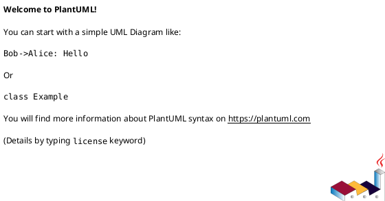

# 13. Software Architecture Document (SAD)

## 13.1 Architecture Overview

* Architectural Style:
* Justification:

---

## 13.2 C4 Model

### Level 1 — System Context

```plantuml id="dbowav"
@startuml
Actor User
System System
User -> System
@enduml
```

---

### Level 2 — Container Diagram



---

### Level 3 — Component Diagram


---

## 13.3 Component Breakdown

### Component: {{Name}}

* Responsibility:
* Interfaces:
* Dependencies:

---

## 13.4 Deployment Architecture

* Cloud Provider:
* Regions:
* Services:
* Scaling Strategy:
* Security Zones:

---

# 14. API Specification (OpenAPI-style)

## 14.1 Endpoint List

### {{METHOD}} {{/path}}

**Description:**

---

## 14.2 Request Schema

```json id="2ntf1d"
{}
```

---

## 14.3 Response Schema

```json id="grdnfn"
{}
```

---

## 14.4 Error Response (RFC 9457)

```json id="6ax4x8"
{
  "type": "",
  "title": "",
  "status": 400,
  "detail": ""
}
```

---

## 14.5 Examples

### Request Example

```json id="2p99tf"
{}
```

### Response Example

```json id="olpavc"
{}
```

---

# 15. Data & Compliance Model

## 15.1 Data Classification

| Data | Type | Classification |
| ---- | ---- | -------------- |

---

## 15.2 Retention Matrix

| Data Type | Retention | Legal Basis | Deletion |
| --------- | --------- | ----------- | -------- |

---

## 15.3 Legal Basis per Feature

| Feature | Legal Basis | Notes |
| ------- | ----------- | ----- |

---

## 15.4 Audit & Logging

* Access logs:
* Data access traceability:
* Export audit:

---

# 16. Open Questions

* Q1:
* Q2:

---
